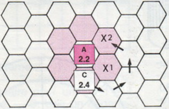

# Game Design choices taken regarding the source document/rules

The original rules had an additional constraint for their wording given the nature of the source document; all of the rules (apperently) needed to fit on a magazine "centerpiece" (i.e. a pair of consecutive pages that the magazine can be laid open to display both of them simultaneously). In any case, the wording is sometimes vague, and this project's author has not been able to find any clarifications in either the rest of the magazine or following issues.

Thus, additional decisions regarding game play and rules specifics were made. They are recorded as follows.

## Phase and Turn Succession (Move/Move/Fight/Fight vs Move/Fight/Move/Fight)
### Problem statement
The document is unclear on whether players take turns:
1. moving their units *and* declaring and resolving combats, or
2. moving their units, *and then* declaring and resolving combats.

More concretely: after the Orfburg player has finished their movement phase, does play proceed to the Orfburg player's combat phase, or does play proceed to the Wulfenberg player's movement phase (the Orfburg player always going first)?
### Choice made: Move/Fight/Move/Fight
The Orfburg player, once declaring their Movement Phase finished, directly proceeds to their Combat Phase. After they similarly declare that Combat Phase to be finished, play proceeds to the Wulfenberg player's Movement Phase.

## Victory Condition Detection / Game Resolution (Early Win?)
### Problem statement
The document is unclear on *when* to inspect the game state to declare the overall game result:
1. as soon as it "could be" determined,
2. after each full turn,
3. somewhere in-between the 2 preceding,
4. only after the max amount (15) of turns has passed (unless a duke just died, of course)

More concretely: the Orfburg player currently has units on every tile of the "city minor objective" (Kaiserburg). No player has units on the other minor objective (the "between rivers" parcel of Orfburg territory). The player proceeds to move a unit into the "between rivers" territory. Does the game end immediately as a Orfburg minor victory, does it end as such after the Wulfenberg player has played their 2 phases, or does the Orfburg only need to be controlling the minor territories at the end of turn 15?
### Choice made: Play as long as possible
Play continues until the end of turn 15, upon which the victory conditions are evaluated and minor/major victory attributed to a faction. The only exception is the death of a Duke, which immediately ends the game in a major victory for the opposing faction.

This presents several benefits:
- simplified game logic, as we only need to introspect the entire game state for victory conditions once.
- prevents "cheese" strategies that could cheapen the feeling of victory or defeat; for example, a concerted push on an early turn could immediately give a minor victory to one faction, while their opponent could successfully contest the objective(s) in play in the following turns.
- increases value of longer-turn strategy over all 15 turns?
- increases chances of interesting turn-by-turn decisions for players emerging from gameplay?

## Combat Specifics
### Retreat
#### Directions Allowed (What Is Backwards?)
##### Problem statement
The document is unclear on whether moving "backwards" means in the context of a retreat:
1. remaining in the existing attacker/defender axis, effectively moving "straight" backwards,
2. moving to any tile that increases the attacker/defender distance by 1, effectively moving either "straight" backwards or "diagonally".

More concretely, consider an adjacent attacker/defender pair (respectively `A` and `C` in the following figure:

To retreat, the attacker could either choose from any of the top three pink tiles, or be forced to choose the tile above it.
##### Choice made: Backwards is Straight
Units can only retreat following the axis determined by their tile and the "center of mass" of attacker's tiles, **away** from that center. If this falls upon the border between 2 tiles, a **random** choice is made between the 2.

This gives us:
- simplicity in implementation (no need to hand control over to opposite player, no need to discriminate between attacker retreating and defender retreating in logic)
- simplicity in gameplay (less granular decisions for the player to make, player retains control throughout their turn)

#### Pushing Allies (Chain vs Single)
##### Problem statement
The document is unclear on how many allied units can be "pushed" out of the way for a retreating unit. Two obvious choices:
1. only 1 unit can move out of the way,
2. an unlimited amount of units can move out of the way (if the last in the "retreat chain" has at least 1 empty tile to move into beforehand).

More concretely: a unit is adjacent to an enemy unit, and is surrounded on the other neighbouring tiles by allied units. Some of these allied units are *also* effectively surrounded by allied units (effectively in the sense that at least one neighbouring, otherwise accessible tile is currently occupied by an allied unit). The first unit in question attacks the enemy unit, on its own, which resolves to an `AttackersRetreat` result. Can another allied unit move out of the way of one of the allied units adjacent to the first, or does a *different* adjacent unit [that *can* move to a different tile] need to move out of the way?

The logic for the 2 could be combined to further generalize to an arbitrary limit - finite or not. However, it does not appear obvious to this project's author that such a design decision would intrinsicly make the game more fun than choosing either of the previous choices.
##### Choice made: Single
Only 1 "additional" unit can "participate" in a retreat for a given combat.

Rationale: simplicity in game logic and gameplay. This also makes "lines" of units "deeper" than 2 more risky, rewards flanking more, and makes massed combat more deadly in general, as melee combattants are much more likely to be unable to to retreat from a lost combat.

### Exchange
#### Loss Allocation (Random vs Player Choice)
##### Problem statement
The document is unclear on whether loss allocation amongst the attackers of an exchange is up to any player's choice. The choices are:
- the attacking player allocates them
- the defending player allocates them
- the losses amongst the attackers are allocated at random (amongst melee attackers, of course)
##### Choice made: Attacking Player Allocates
The attacker selects attacking units until their combined offensive strength equals that of the [killed] defender's defensive strength.

#### Which Strength (Effective vs Base)
##### Problem statement
The document is unclear on whether loss allocation during an exchange is based off of the base attack strength of each attacker, or their effective strength given the current position of all units on the board.

More concretely: are terrain- and duke-aura-based strength multipliers applied when referencing "how much" attacker strength needs to be allocated as a loss for an Exchange combat result?
##### Choice made: Effective
Total attack strength includes duke aura effects, and defender's defensive strength is affected by terrain and duke aura multipliers. This increases the risk towards attackers when attacking "garisonned" units (and reduces risk for those defenders), and increases the impact of duke's auras.
