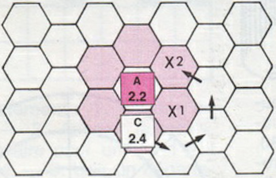

## règle du jeu

### HISTORIQUE
Depuis trois cents ans, les ducs d'Orfburg et de Wulfenburg s'affrontent
régulièrement pour un litige frontalier qui met en cause la ville de Kaiserburg
et le territoire compris entre les deux bras de la rivière. Il y a trente ans,
au terme d'une longue bataille, le duc de Wulfenburg reprit Kaiserburg, mais ne
put se rendre maître du « territoire des deux rivières ».

Après trente ans de paix armée, le duc d'Orfburg déclara la guerre à son vieil
ennemi. Son but : reprendre Kaiserburg, bien entendu. C'est cette « Guerre des
Ducs » que vous allez faire revivre. Ce jeu d'initiation, volontairement
simple, est destiné à familiariser les débutants avec le principes de base du
jeu de guerre (Wargame) et de donner un exemple assez réaliste du thème «
napoléonien ».

# la guerre des ducs

### LE JEU
Nombre de joueurs : 2  
Éléments du jeu :
 - une carte géographique divisée en cases hexagonales ;
 - des pions (à découper) ;
 - une table de résultats et une table des effets de terrain directement
   imprimées sur la carte ;
 - il faut également se munir d'un dé.

Il y a 31 pions par pays (plus un pion marqueur de tours), soit : 1 duc ; 10
unités d'infanterie ; 10 unités de cavalerie ; 10 unités d'artillerie.

Ces pions portent des symboles (correspondant au code de l'OTAN) :

[X] infanterie ; [/] cavalerie ; [·] artillerie ;

et une couronne pour le duc. Ils portent également les indications suivantes :
 - début du nom du pays : ORF (pour Orfburg) et WULF (pour Wulfenburg) ;
 - à gauche, un nombre donnant la force d'attaque et de défense ;
 - à droite, un nombre donnant le potentiel de déplacement (points de mouvements) ;
 - pour l'artillerie seulement, en haut à droite, le nombre 2 rappelle la
   portée des canons : deux cases.

**but du jeu :** s'assurer une conquête territoriale décisive ou anéantir le
duc ou les troupes adverses. Comme on va le voir, une des particularités de la
Guerre des Ducs est que la situation des deux adversaires n'est pas symétrique
: ils ne se trouvent pas exactement dans les mêmes conditions pour s'assurer
la victoire.

**mise en place des pions sur la carte :** chaque joueur place une de ses unités
sur chaque case de ville ou de forteresse qu'il possède. Ensuite, l'un après
l'autre, et pièce par pièce, ils posent le reste de leur unités à l'intérieur
de leurs frontières, jusqu'à ce qu'elles soient toutes en place.  
Le joueur qui possède l'Orfburg commence toujours la partie.

**durée du jeu :** le jeu se déroule en 15 tours maximum, que l'on compte en
faisant avancer le pion marqueur de tours sur l'échelle indicatrice à la fin de
chaque tour.  
Chaque tour est lui-même divisé en deux phases, correspondant chacune aux
différentes actions d'un des joueurs. Quand les deux adversaires ont joué, le
tour est achevé, et l'on passe au tour suivant.

**les ducs :** les deux pions représentant les ducs n'ont qu'un potentiel de
défense : ils ne peuvent pas attaquer directement. En revanche, leur présence,
a moins de deux cases, d'unités de leur camp, « fanatise » leurs troupes et
double le potentiel d'attaque ou de défense de ces dernières.  
Les ducs subissent, comme tout autre pion, les résultats des combats. En
particulier, un duc peut-être éliminé au cours d'une bataille. Dans ce cas, la
partie s'arrête immédiatement et le joueur qui le possède a perdu, même si
les autres conditions de la victoire ne sont pas remplies.

**les forteresses :** les forteresses ne peuvent contenir qu'une unité (plus
éventuellement un duc, qui ne compte pas pour une unité). Sans garnison, elles
sont sans défense et peuvent être occupées par l'un ou l'autre des
belligérants. Les unités d'artillerie peuvent tirer à partir d'une forteresse.

**conditions de victoire :** les deux belligérants n'obtiennent pas la victoire
dans les mêmes conditions.

**1 :** Victoire marginale : le duché d'Orfburg gagne en s'emparant de la ville
de Kaiserburg, tout en conservant le territoire compris entre les deux
rivières. De son coté, le duché de Wulfenburg sera vainqueur s'il parvient à
empêcher la réalisation de l'une de ces deux conditions.

**2 :** Victoire totale : la victoire totale est acquise pour l'un de deux pays
avec la conquête de la capitale adverse, ou l'élimination du duc ennemi.

**mouvements :** pendant sa phase active, chaque joueur déplace autant d'unités
qu'il le désire, dans la limite des points de mouvements attribuées à chaque
unité. Voici le nombre de points nécessaires pour se déplacer d'une case, selon
la nature du terrain :

    routes : .......... 1/2 point par case
    villes : .......... 1/2 point par case
    terrain normal : .. 1 point par case
    ponts: ............ 1 point par case (mais 1/2 point si le pont est franchi par une route)
    bois : ............ 2 points par case
    hauteurs (brun) : . 2 points par case
    rivières : ........ infranchissables en dehors des ponts
    lacs : ............ infranchissables.

(Note : si une unité doit emprunter une route au cours d'un mouvement, et si
elle ne se trouve pas sur cette route au début de son déplacement, elle doit
d'abord utiliser pour l'atteindre le nombre de points de mouvements nécessités
par la nature du terrain qui la sépare de la route.)

// page 2

**limitations des mouvements** : une unité ne peut en aucun cas se placer sur une
case occupée par une autre unité, amie ou ennemie. Seule exception : le duc,
qui, sur les cases de villes ou de forteresses, peut se placer sur une autre
unité amie. Mais au cours d'un déplacement, une unité peut traverser une case
occupée par une unité du même pays.

**zones de contrôle :** chaque unité exerce une influence particulière sur les
six cases qui environnent celle qu'elle occupe : ces six cases constituent sa «
zone de contrôle ». Les zones de contrôle présentent des propriétés
particulières :

 - une unité peut pénétrer dans une zone de contrôle ennemie sans dépense de
   points supplémentaire, mais elle n'a pas le droit de s'y déplacer : elle
   doit donc s'arrêter dès qu'elle y est entrée ;

 - on ne peut donc passer d'une zone de contrôle à une autre qu'après être
   sortie de la première ;

 - les zones de contrôle ne s'exercent pas au-delà d'une rivière, mais
   franchissent les ponts ;

 - il est interdit de faire retraite dans une zone de contrôle ennemie.

Exemple :

l'unité C, se trouvant dans la zone de contrôle de A, ne peut atteindre la case
`X2` en passant par la case `X1`, qui se trouve également dans la zone de
contrôle de A. Elle sera obligée de sortir de la zone, de contourner `X1` et de
pénétrer de nouveau dans la zone en `X2`. Elle dépensera donc 4 points de
mouvement au lieu de 2.

**les combats :** pour livrer bataille, il faut que l'unité attaquante se
trouve à une proximité suffisante de l'unité attaquée : cases contiguës pour
l'infanterie et la cavalerie, une case d'écart pour l'artillerie. Plusieurs
unités d'un même pays peuvent attaquer une seule unité adverse, pourvu que
chaque unité attaquante remplisse les conditions de proximité.  
Le combat étant déclaré, on additionne les points des unités attaquantes, puis
les points de la défense (ceux-ci sont multipliés par deux si elle se trouve
dans une ville, par trois dans une forteresse). On fait le rapport des points,
lequel s'exprime en plaçant l'attaquant en numérateur et le défenseur en
dénominateur. Il peut aller de 1/5 (ou « 1 contre 5 ») à 6/1 (ou « 6 contre 1
»). L'attaquant jette alors le dé. Le nombre obtenu est modifié, le cas
échéant, par la nature du terrain (voir la « table des effets du terrain »). Et
l'on reporte, sur la « table des résultats », le rapport des forces et le
nombre donné par les dés. Le croisement des deux lignes donne le résultat du
combat.  
Celui-ci s'exprime par un couple de lettres, dont voici la signification :

  Ae (attaquant éliminé) : les unités attaquantes sont retirées du jeu.  
  Ar (attaquant recule) : les unités attaquantes reculent d'une case.  
  De (défense éliminée) : les unités de défense sont retirées du jeu.  
  Dr (défense recule) : les unités de défense reculent d'une case.  
  Ex (échange) : les unités de défense sont retirées du jeu, ainsi que les
  unités attaquantes totalisant une force au moins égale.

Une unité qui se trouve dans l'impossibilité de reculer, parce qu'elle a
derrière elle un lac, une rivière ou une zone de contrôle, est retirée du jeu,
sauf si elle est entourée d'unités amies : dans ce cas, elle pousse une de ces
pièces et prend sa place.  
On tiendra également compte des trois règles suivantes :
 - on ne peut attaquer une unité donnée qu'une seule fois au cours de la même
   phase ;
 - une unité donnée (ou un groupe d'unités) ne peut attaquer qu'une seule unité
   ennemie durant la même phase ;
 - plusieurs unités amies peuvent s'allier pour attaquer une unité adverse,
   mais cette action ne constitue qu'un seul combat, comportant un seul jet de
   dés.  

Les résultats du combat sont applicables immédiatement, avant le début de la
phase suivante.

**cas de l'artillerie :** une unité d'artillerie peut livrer bataille : soit à
une distance de deux cases (bombardement), soit contre une unité contiguë
(corps à corps). Dans le cas d'un bombardement, elle ne subit ni retraite, ni
échange. En revanche, dans un combat corps à corps, elle subit les résultats de
la table, comme n'importe quelle autre pièce.

**avance après les combats :** lorsque l'issue d'un combat oblige le défenseur
à faire retraite, l'unité attaquante peut, si elle le désire, occuper la case
que le défenseur abandonne, et ceci sans tenir compte des zones d'influence,
ni des limites de déplacements qui lui sont propres.  
La décision d'occuper ou non la case de l'adversaire doit être annoncée
immédiatement après le combat. Cette décision est immuable : on ne peut en
aucun cas la modifier par la suite.

**F.M.-F.**
